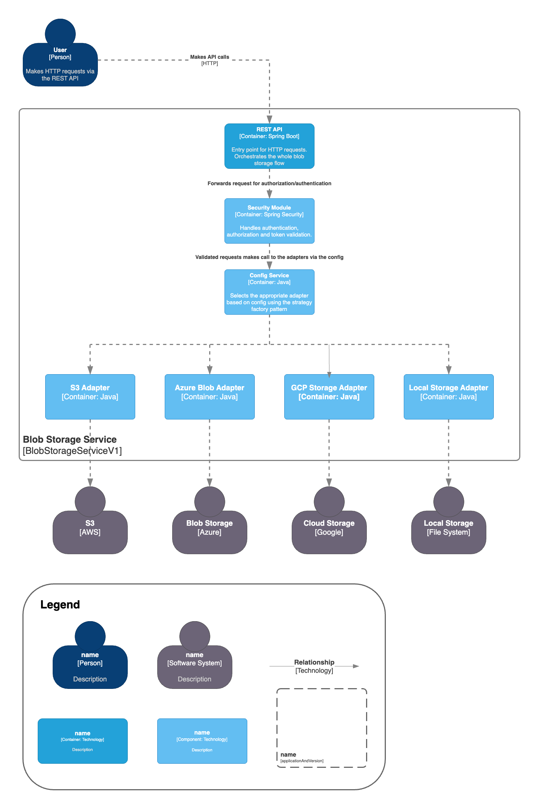
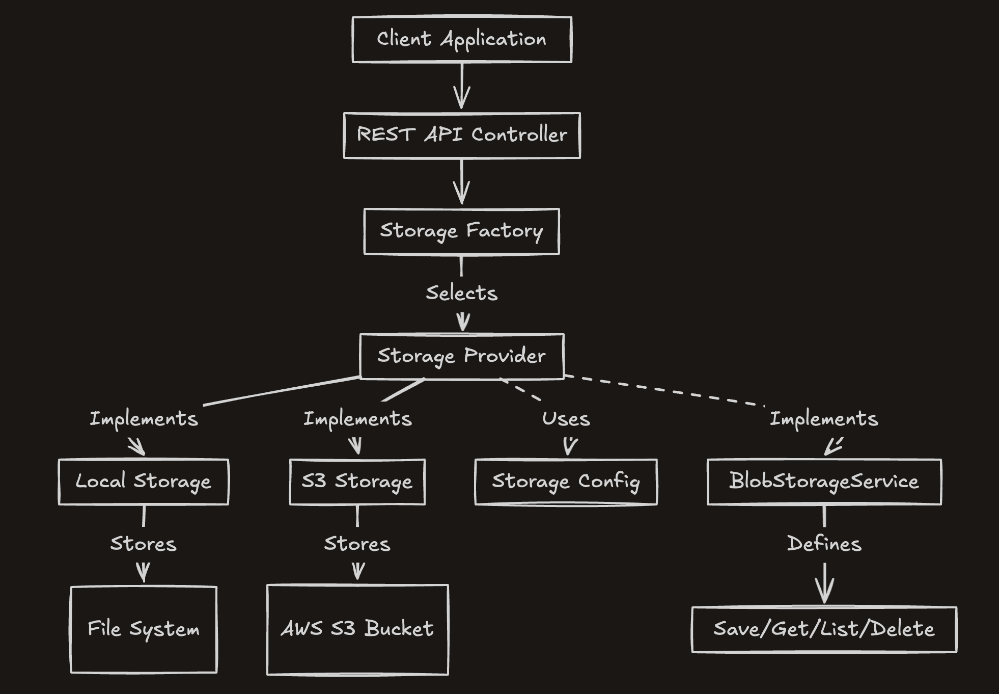
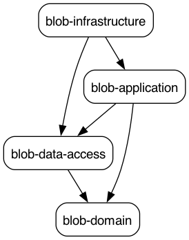

# blob storage app

this project started as a pet project, mainly a way to get better at architecting software, dig deeper into software engineering principles, and practice designing services that actually follow modern patterns. it's been a hands-on way to upskill in java, revisit some old concepts, and try out new ones as i learn them. whenever i pick up something interesting, i try to fold it in here.

---

## why this design?

started with a simple goal: make it easy for users (or tenants) to store blobs in whatever cloud they want - aws, azure, gcp, or even just the local filesystem. but didn't want a big ball of mud where everything is tightly coupled. wanted:
- swappable storage backends (add s3, azure, gcp, or local with minimal fuss)
- testability (unit, integration, and repo tests that don't need a real cloud account)
- security (api keys, pre-signed urls, and a clear security boundary)
- a codebase that's easy to reason about (and extend, and debug)

went with a strict hexagonal architecture (a.k.a. ports and adapters). the core domain logic is totally isolated from frameworks and cloud sdks. all the "messy" stuff - cloud apis, http, security, persistence - lives in adapters on the outside.

---

## design decisions & tradeoffs

### hexagonal architecture
- why? wanted to keep business logic pure and portable. this way, you can swap out storage backends, change your api layer, or even move to a different framework without rewriting your core logic.
- what worked: the separation is super clear. domain logic is easy to test. adding a new storage provider is just a matter of implementing a port.
- what was tricky: sometimes it feels like you're writing a lot of interfaces and boilerplate. but it pays off when you need to add or swap adapters.

### byoc & strategy/factory pattern
- why? real-world users want to bring their own cloud. didn't want to hardcode s3 or any other provider. the factory pattern lets us pick the right adapter at runtime, based on user, tenant, or even per-request config.
- what worked: it's genuinely flexible. you can add new providers without touching the core logic.
- tradeoff: more moving parts. you need a good config service and a way to map users/tenants to providers.

### modularity (maven multi-module)
- why? keeps boundaries clear. each module has a single responsibility: domain, application, data-access, infrastructure.
- what worked: easy to enforce dependencies (e.g., domain knows nothing about infrastructure). tests are fast and focused.
- what was tricky: spring boot tests in submodules need careful config (see test setup for details).

### adapter pattern for storage
- why? each storage backend (s3, local, etc.) is its own adapter, all using the same port interface. this keeps the codebase open for extension, closed for modification.
- what worked: swapping adapters is trivial. you can even run tests with a fake or in-memory adapter.
- tradeoff: more interfaces and wiring, but worth it for flexibility.

### security
- why? wanted a simple but effective api key system, with room to grow (oauth, jwt, etc. later).
- what worked: api key filter is easy to extend. security is handled before requests hit the core logic.
- what's next: more granular roles, rate limiting, and audit logging.

### testing
- why? wanted fast feedback and confidence in changes. unit tests for domain logic, repository tests with h2, and (soon) integration tests for the full stack.
- what worked: h2 is great for jpa tests. the domain is easy to test in isolation.
- what's tricky: multi-module spring boot tests need explicit config. will add testcontainers for postgresql/mongodb soon.

### tradeoffs & lessons learned so far
- flexibility vs. simplicity: hexagonal architecture and byoc add some complexity, but the flexibility is worth it for real-world use cases.
- testing in multi-module projects: you need to be explicit about your test config, or spring boot will get confused.
- documentation: good diagrams and a clear readme make onboarding and debugging much easier (hence all the diagrams and this writeup!).

probably will write a blog post or two about some of these decisions - there's a lot to unpack!

---

## architecture overview

this project follows a strict hexagonal (ports and adapters) architecture, with clear separation between domain, application, data-access, and infrastructure layers. the design is inspired by best practices for maintainability, testability, and cloud extensibility.

### key diagrams

- **c4 model**: high-level system context and container diagrams
  
- **component/package structure**: visualizes the main modules and their relationships
  

---

## module structure

- **blob-domain**: core business logic, entities, value objects, and domain events. no dependencies on any other module.
- **blob-data-access**: jpa repositories and data access logic. depends only on the domain module.
- **blob-application**: application services, use cases, and ports. depends on domain and data-access.
- **blob-infrastructure**: rest api, security, storage adapters (s3, local, etc.), and configuration. depends on all other modules.

---

## bring your own cloud (byoc) & storage adapters
this approach to the system was inspired by a service built in Slightly techie, but in c#.

- **strategy/factory pattern**: the application dynamically selects the appropriate storage adapter (s3, local, azure, gcp, etc.) per request, based on user/tenant or api input.
- **adapters**: each storage backend (s3, local filesystem, etc.) is implemented as a separate adapter, all conforming to a common port interface.
- **config service**: centralizes the logic for selecting the correct adapter at runtime.

---

## security

- **api key authentication**: all endpoints are protected by an api key, validated via a security filter.
- **spring security**: handles authentication, authorization, and context propagation.

---

## api documentation

- **openapi/swagger**: api docs are auto-generated and available at `/swagger-ui.html` and `/api-docs` when the app is running.

---

## testing

- **unit tests**: cover domain logic, application services, and adapters.
- **repository tests**: use h2 in-memory database for fast, isolated jpa tests.
- **integration tests**: (recommended) place in the infrastructure module to test the full stack.

---

## dependency graph

to visualize module and package dependencies, use:

```sh
mvn com.github.ferstl:depgraph-maven-plugin:4.0.1:aggregate \
  -DcreateImage=true \
  -DreduceEdges=false \
  -DclasspathScope=compile \
  -DoutputType=full \
  -Dincludes=com.upskill
```

the resulting graph (see below) shows the clean, layered structure of the codebase:



---

## how to run

1. build the project:
   ```sh
   mvn clean package
   ```
2. run the spring boot app from the `blob-infrastructure` module:
   ```sh
   cd blob-infrastructure
   mvn spring-boot:run
   ```
3. access the api docs at [http://localhost:8080/swagger-ui.html](http://localhost:8080/swagger-ui.html)

---

## extending the system

- to add a new storage provider, implement the `BlobStoragePort` interface and register your adapter in the strategy factory.
- to support new authentication methods, extend the security module.
- for new business logic, add to the domain and application layers.

---

## contributing

currently porting old updates from a prior repo this. reviewing decisions i took and updating the code to a good base form for the service

---

## resources & further reading

- [storage 101: object storage in the big three public clouds (computerweekly)](https://www.computerweekly.com/feature/Storage-101-Object-storage-in-the-big-three-public-clouds)
- [use spring boot to upload a file to azure blob storage (microsoft docs)](https://learn.microsoft.com/en-us/azure/developer/java/spring-framework/configure-spring-boot-starter-java-app-with-azure-storage)
- [cloud-storage-spring-api (github)](https://github.com/migangqui/cloud-storage-spring-api)
- [youtube: object storage explained](https://www.youtube.com/watch?v=sswLpKeAoxs)
- [baeldung: java strategy pattern](https://www.baeldung.com/java-strategy-pattern)
- [s3, gcs, and azure blob storage compared (airbyte)](https://airbyte.com/data-engineering-resources/s3-gcs-and-azure-blob-storage-compared)
- [youtube: aws s3 vs azure blob vs google cloud storage](https://www.youtube.com/watch?v=AV4Ei1qW89o)
- [youtube: clean architecture explained](https://www.youtube.com/watch?v=bmSAYlu0NcY)
- [refactoring guru](https://refactoring.guru/)
- [oop design patterns and anti-patterns (bytebytego)](https://blog.bytebytego.com/p/oop-design-patterns-and-anti-patterns)
- [object-oriented programming cheatsheet (github)](https://github.com/niloycste/Object-Oriented-Programming-Cheatsheet)
- [domain driven design: tackling complexity in the heart of software](https://fabiofumarola.github.io/nosql/readingMaterial/Evans03.pdf)

---

_a postman collection for api exploration will be added soon._